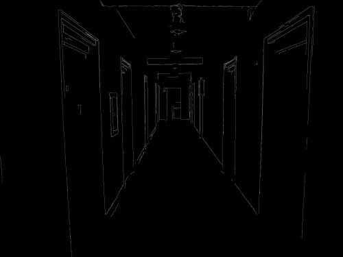
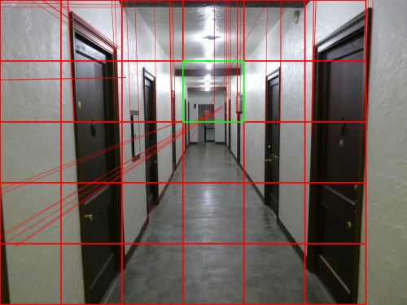
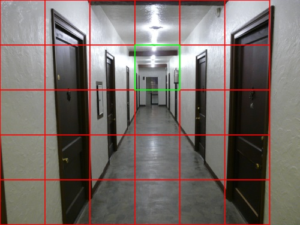

# vanishing-point-detection

Estimate the [Vanishing Point](https://en.wikipedia.org/wiki/Vanishing_point) of an image.

## Requirements

- Python 3
- Numpy
- OpenCV

## Usage

Next to the `src` directory, have a `pictures` directory, with nested dirs `input` and `output`.

For visualizations of the intermediate steps, try checking out the  `draw-intermediate-steps` branch, which for an input image, will also output:

- Canny edge output
- Hough transform
- Grid segmentation of image and estimated vanishing point cell

## Example

Running it a corridor image from [here](https://commons.wikimedia.org/wiki/File:300_Corridor,_Inside.jpg), the output steps are:

Canny Edge Output

Hough Transform

Grid Segmentation and Estimated Vanishing Point

Final

